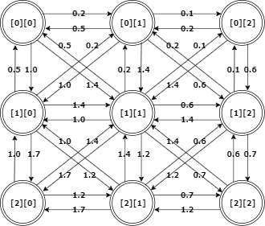

Implementation details
------

The application draws two-dimensional arrays, or heightmaps, on a JavaFX canvas where each array value is a pixel that is assigned an appropriate color depending on display mode. 

There are two algorithms implemented for the generation of maps, Perlin noise and diamond-square. Both are so-called noise functions and produce a 2D array of values in the range [-1.0, 1.0].

There is also a class for adding rivers to a heightmap. This works by using Dijkstra's algorithm to find shortest paths in a graph created from the heightmap and adjusting the original's values on the river's path.

Below are given descriptions and details related to the implementation of algorithms, data structures and functions used in this project.

Algorithms
------

### Perlin noise
Perlin noise works by filling an n-dimensional grid with n-dimensional random vectors on the basis of which noise values at given points are determined. Noise value is computed by first determining which cell a grid point falls into. Cell is a separate concept from grid point, and is relative to current scale: i.e. most of the time there would be multiple grid points located inside a cell. Then, we compute the dot products between the distance vector of the given point and each of the random vectors at the corners of the corresponding grid point. Finally, we interpolate between the dot products and return the value.

We typically add together and divide by maximum value several iterations of noise, each of which is called an octave. The scale and amplitude (a factor applied to noise values to affect their range) values are adjusted for each successive octave. This layering causes the "fractal-like" effect and creates maps with more details. Below on the left is a greyscale representation of one octave of Perlin noise, while the one on the right has six octaves. 

Perlin noise has a time complexity of O(2^n) where n equals number of dimensions, with significant constant factors due to the application of math functions and several layers of noise. For this project, the time complexity should be O(n) where n is the number of pixels in the map.

### Diamond-square algorithm
The diamond-square algorithm works by first assigning values to the four corner points of a 2D array of size 2^n+1. After this, we alternately compute the midpoints of each "square" and "diamond" formed in the grid by existing points. Each midpoint value is the average of its four corner points plus a random value. The below image illustrates each step of the algorithm, from the initial assignment of corner values followed by the diamond and square steps:

The time complexity of diamond-square is O(n) where n is the number of pixels in the map.

### Dijkstra's algorithm
Dijkstra's algorithm is used to find shortest paths between nodes in a graph. Here it is used to generate rivers in a heightmap. The heightmap array is converted into a graph where each array point has an incoming and outgoing edge from and to each adjacent array point. The weight of an edge is the value of the heightmap point corresponding to the destination node (+1.0 to avoid negative values in the graph).

For example, the heightmap {{-0.5, -0.8, -0.9}, {0.0, 0.4, -0.4}, {0.7, 0.2, -0.3}} would have the following edges and weights:

A river is generated by finding the shortest path between its designated start and end points and saving the nodes on the path. Then, the value of each heightmap point corresponding to a node on the path is lowered. Lower values in the heightmap mean lower terain, so a shortest path in the graph is the path of least resistance for a river.

Dijkstra's algorithm runs in time O(e + n log n) where n is nodes and e is edges.

Data structures
------

### Min heap priority queue
Graph nodes are stored in a priority queue for ordering them by smallest cost when running Dijkstra's algorithm. The code is based on the MaxPQ class described in Sedgewick & Wayne: *Algorithms*.

| Operation | Time     |
|-----------|----------|
| poll()    | O(log n) |
| add()     | O(log n) |
| isEmpty() | O(1)     |

### Integer set
A set structure for integers. Used in recording and retrieving node neighbors for Dijkstra's algorithm. In this context n has a max value of 8. 

| Operation | Time     |
|-----------|----------|
| add()     | O(n)     |
| contains()| O(n)     |
| getSet()  | O(n)     |

### Random
A pseudorandom number generator based on the Mersenne Twister algorithm.

Sources
------

- https://en.wikipedia.org/wiki/Perlin_noise
- https://en.wikipedia.org/wiki/Diamond-square_algorithm
- https://longwelwind.net/2017/02/09/perlin-noise.html
- https://learn.64bitdragon.com/articles/computer-science/procedural-generation/the-diamond-square-algorithm
- https://en.wikipedia.org/wiki/Dijkstra%27s_algorithm
- https://en.wikipedia.org/wiki/Mersenne_Twister#Pseudocode
- http://www.math.sci.hiroshima-u.ac.jp/~m-mat/MT/VERSIONS/C-LANG/mt19937-64.c
- Sedgewick & Wayne: *Algorithms* 4th edition 
